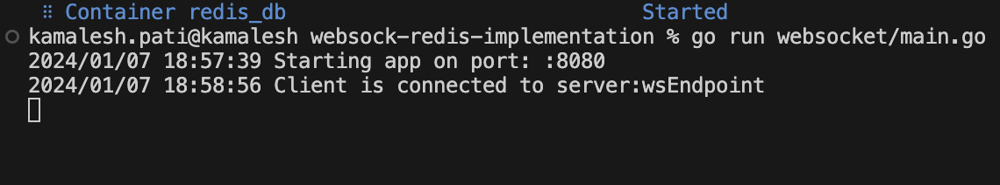

# websocket-redis-golang-playground

## Instruction given
setup a project in golang that is connected to redis pub/sub, and uses websockets.

## Features
* websocket server using gorila
* redis pub/sub connection
* code pushes the data to specific channel
* a subscriber consumes message and prints it on cmd
* config reading from .env

## Run Locally  
Clone the project  

~~~bash  
  git clone https://github.com/kamaleshpati/wsredisPlayground
~~~

Go to the project directory  

~~~bash  
  cd wsredisPlayground/
~~~

Start the redis  

~~~bash  
docker compose up -d
~~~  

Start the server  

~~~bash  
go run github.com/kamaleshpati/wsredisPlayground/cmd/wsredisPlayground    
~~~  

## Screenshots 
### Server up  

### Server connected postman  

### Server connected comamndline

### message from postman

### message shown in commandline with publishing and subscribing
